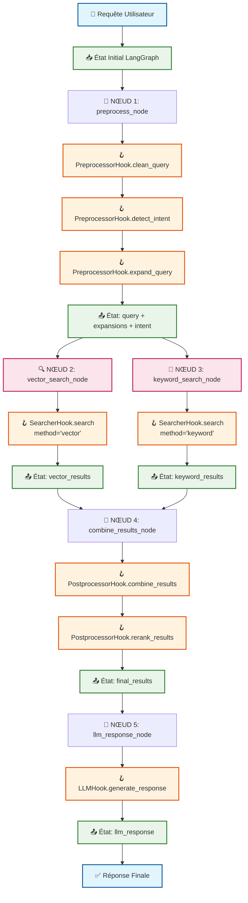
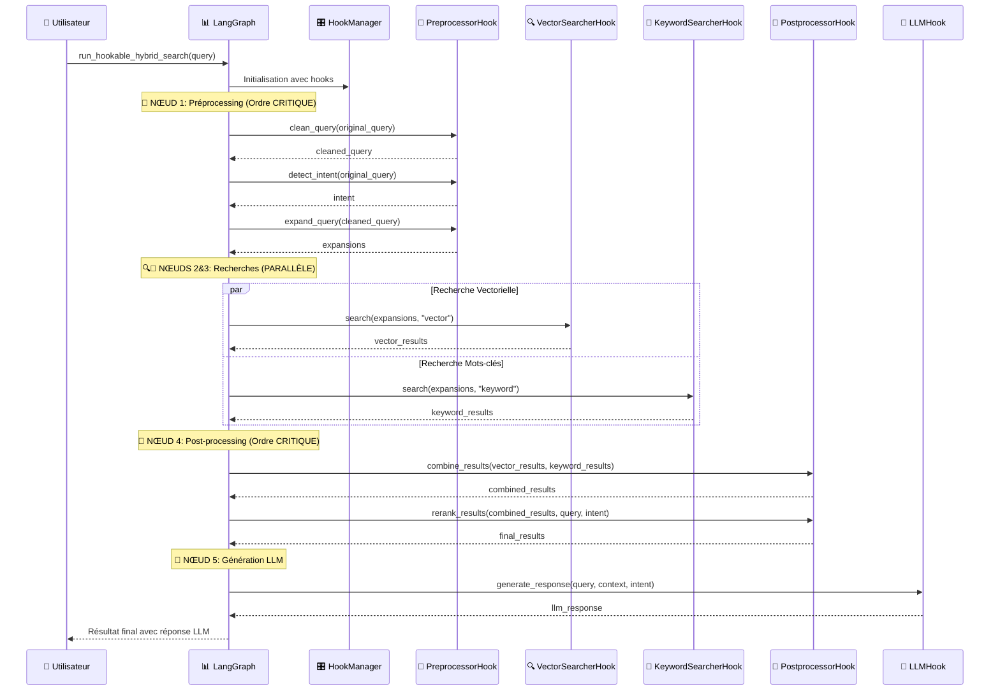

# 🔍 Hybrid Search avec LangGraph et Architecture de Hooks

Système de recherche hybride modulaire combinant recherche vectorielle et par mots-clés, orchestré par LangGraph avec système de hooks complet pour remplacer chaque implémentation.

## 🎯 Vue d'ensemble

Ce projet implémente un workflow de recherche hybride avec **5 nœuds LangGraph** et un **système de hooks** qui permet de :
- Combiner recherche vectorielle (embeddings) et recherche par mots-clés (TF-IDF)
- Remplacer chaque étape par une implémentation personnalisée via des hooks
- Utiliser LangGraph pour orchestrer le pipeline
- Générer une réponse finale avec OpenAI GPT-4o-mini

## 🏗️ Architecture du Graphe LangGraph

### Nœuds du Graphe

| Nœud | Fonction | Ordre | Hook Interface | Description |
|------|----------|-------|----------------|-------------|
| **1. preprocess** | `preprocess_node()` | 🔴 **Critique** | `PreprocessorHook` | Nettoyage, expansion, détection d'intention |
| **2. vector_search** | `vector_search_node()` | 🟢 **Parallèle** | `SearcherHook` | Recherche avec embeddings (similarité cosinus) |
| **3. keyword_search** | `keyword_search_node()` | 🟢 **Parallèle** | `SearcherHook` | Recherche TF-IDF par mots-clés |
| **4. combine** | `combine_results_node()` | 🔴 **Critique** | `PostprocessorHook` | Fusion scores + re-ranking |
| **5. llm_response** | `llm_response_node()` | 🔴 **Critique** | `LLMHook` | Génération réponse OpenAI |

### Flux d'Exécution

```
preprocess → vector_search   → combine → llm_response
          ↘ keyword_search ↗
```

**Recherches en parallèle** : `vector_search` et `keyword_search` s'exécutent simultanément après `preprocess`.

### Workflow Détaillé avec Hooks



### Ordre d'Exécution des Hooks



## 🪝 Système de Hooks

### Interfaces de Hooks

Le système définit 4 interfaces abstraites pour remplacer chaque étape :

```python
class PreprocessorHook(ABC):
    @abstractmethod
    async def clean_query(self, query: str) -> str: ...
    
    @abstractmethod
    async def expand_query(self, query: str) -> List[str]: ...
    
    @abstractmethod
    async def detect_intent(self, query: str) -> str: ...

class SearcherHook(ABC):
    @abstractmethod
    async def search(self, queries: List[str], method: str) -> List[Dict]: ...

class PostprocessorHook(ABC):
    @abstractmethod
    async def combine_results(self, vector_results, keyword_results) -> List[Dict]: ...
    
    @abstractmethod
    async def rerank_results(self, results, query, intent) -> List[Dict]: ...

class LLMHook(ABC):
    @abstractmethod
    async def generate_response(self, query: str, context: str, intent: str) -> str: ...
```

### Gestionnaire de Hooks

```python
class HookManager:
    def __init__(self):
        # Implémentations par défaut
        self.preprocessor = DefaultPreprocessor()
        self.searcher = DefaultSearcher()
        self.postprocessor = DefaultPostprocessor()
        self.llm = DefaultLLM()
    
    def register_preprocessor(self, hook: PreprocessorHook, name: str): ...
    def register_searcher(self, hook: SearcherHook, name: str): ...
    def register_postprocessor(self, hook: PostprocessorHook, name: str): ...
    def register_llm(self, hook: LLMHook, name: str): ...
```

## ⚙️ Ordres de Priorité et Contraintes

### 🔴 Ordre Critique (Séquentiel)

**1. Pré-traitement** :
```python
# OBLIGATOIRE : nettoyage AVANT expansion
cleaned = await hook.clean_query(query)        # Étape 1
expansions = await hook.expand_query(cleaned)   # Étape 2 (dépend de 1)
intent = await hook.detect_intent(query)        # Peut être parallèle
```

**2. Post-traitement** :
```python
# OBLIGATOIRE : combinaison AVANT re-ranking
combined = await hook.combine_results(vector, keyword)  # Étape 1
reranked = await hook.rerank_results(combined)          # Étape 2 (dépend de 1)
```

### 🟢 Ordre Flexible (Parallèle)

**Recherches hybrides** :
- `vector_search` et `keyword_search` sont **indépendants**
- Utilisent la même interface `SearcherHook.search(queries, method)`
- Peuvent s'exécuter en parallèle sans conflit

## 🔧 Gestion de la Concurrence LangGraph

### Annotations pour États Partagés

```python
class SearchState(TypedDict):
    # Pas de conflit (un seul writer)
    original_query: str
    processed_query: str
    
    # Conflits possibles (writers multiples) - ANNOTATED
    vector_results: Annotated[List[Dict[str, Any]], add]
    keyword_results: Annotated[List[Dict[str, Any]], add]
    processing_metadata: Annotated[Dict[str, Any], merge_dicts]
    performance_metrics: Annotated[Dict[str, float], merge_dicts]
```

### Fonction de Merge Personnalisée

```python
def merge_dicts(a: dict, b: dict) -> dict:
    """Merge deux dictionnaires de manière sûre"""
    result = a.copy() if a else {}
    if b:
        result.update(b)
    return result
```

## 📦 Installation

### Dépendances Principales (requirements.txt)

```bash
# Core LangGraph
langgraph==0.6.4
langchain-core==0.3.27
langchain==0.3.27

# LLM Integration  
langchain-openai==0.3.28
openai==1.55.0

# Machine Learning
scikit-learn==1.5.1
numpy==2.1.0
sentence-transformers==3.0.1
torch==2.4.0

# Optional: NLP avancé
spacy==3.8.2
```

### Installation

```bash
# Installer les dépendances
pip install -r requirements.txt

# Configuration OpenAI
export OPENAI_API_KEY="your-key-here"

# Lancer le script
python app.py
```

## 🚀 Utilisation

### Utilisation Basique (Hooks par Défaut)

```python
import asyncio
from app import run_hookable_hybrid_search

async def main():
    # Utilise les implémentations par défaut
    result = await run_hookable_hybrid_search("qu'est-ce que Python ?")
    print(result["llm_response"])

asyncio.run(main())
```

### Utilisation Avancée avec Hooks Personnalisés

```python
from app import HookManager, CustomPreprocessor, run_hookable_hybrid_search

async def main():
    # Création du gestionnaire
    hook_manager = HookManager()
    
    # Enregistrement d'un hook personnalisé
    hook_manager.register_preprocessor(CustomPreprocessor(), "advanced")
    
    # Utilisation
    result = await run_hookable_hybrid_search(
        "qu'est-ce que Python pour le ML ?", 
        hook_manager
    )
    print(result["llm_response"])

asyncio.run(main())
```

## 🔧 Création de Hooks Personnalisés

### Exemple 1 : Préprocesseur Avancé

```python
class AdvancedPreprocessor(PreprocessorHook):
    """Préprocesseur avec validation et synonymes étendus"""
    
    async def clean_query(self, query: str) -> str:
        # Validation de longueur
        if len(query) < 3:
            return query
        
        # Nettoyage avec regex avancé
        import re
        return re.sub(r'[^\w\s\-\?]', '', query.lower().strip())
    
    async def expand_query(self, query: str) -> List[str]:
        # Expansion avec dictionnaire de synonymes
        expansions = [query]
        
        synonyms = {
            "python": ["python", "programming", "développement", "langage"],
            "ml": ["machine learning", "apprentissage automatique", "IA"],
            "ai": ["intelligence artificielle", "artificial intelligence"]
        }
        
        for term, syns in synonyms.items():
            if term in query.lower():
                for syn in syns:
                    exp = query.replace(term, syn)
                    if exp not in expansions:
                        expansions.append(exp)
        
        return expansions[:5]
    
    async def detect_intent(self, query: str) -> str:
        # Patterns d'intention étendus
        patterns = {
            "definition": ["qu'est-ce", "définir", "définition", "c'est quoi"],
            "how_to": ["comment", "étapes", "procédure", "tutoriel"],
            "comparison": ["différence", "versus", "vs", "comparer"],
            "example": ["exemple", "cas d'usage", "illustration"]
        }
        
        query_lower = query.lower()
        for intent, words in patterns.items():
            if any(word in query_lower for word in words):
                return intent
        return "general"

# Enregistrement
hook_manager.register_preprocessor(AdvancedPreprocessor(), "advanced")
```

### Exemple 2 : Searcher avec Base Vectorielle

```python
class WeaviateSearcher(SearcherHook):
    """Intégration avec Weaviate"""
    
    def __init__(self, weaviate_url: str):
        import weaviate
        self.client = weaviate.Client(weaviate_url)
    
    async def search(self, queries: List[str], method: str) -> List[Dict[str, Any]]:
        if method == "vector":
            return await self._weaviate_search(queries)
        elif method == "keyword":
            return await self._weaviate_bm25_search(queries)
    
    async def _weaviate_search(self, queries: List[str]) -> List[Dict]:
        # Recherche vectorielle dans Weaviate
        results = []
        for query in queries:
            response = (
                self.client.query
                .get("Document", ["title", "content", "category"])
                .with_near_text({"concepts": [query]})
                .with_limit(5)
                .do()
            )
            # Traitement des résultats...
        return results

# Enregistrement
hook_manager.register_searcher(WeaviateSearcher("http://localhost:8080"), "weaviate")
```

### Exemple 3 : LLM avec Modèle Personnalisé

```python
class AnthropicLLM(LLMHook):
    """Utilisation de Claude au lieu d'OpenAI"""
    
    async def generate_response(self, query: str, context: str, intent: str) -> str:
        try:
            from langchain_anthropic import ChatAnthropic
            
            llm = ChatAnthropic(
                model="claude-3-sonnet-20240229",
                temperature=0.7,
                max_tokens=500
            )
            
            prompt = f"""Tu es un assistant expert. 
            
Question: {query}
Intention: {intent}
Contexte: {context}

Réponds de manière structurée et précise."""
            
            response = llm.invoke(prompt)
            return response.content
            
        except Exception as e:
            return f"Erreur Claude: {e}"

# Enregistrement
hook_manager.register_llm(AnthropicLLM(), "claude")
```

### Exemple 4 : Postprocesseur avec ML

```python
class MLPostprocessor(PostprocessorHook):
    """Re-ranking avec modèle ML"""
    
    def __init__(self):
        # Chargement d'un modèle de re-ranking
        # self.rerank_model = load_model("rerank_model.pkl")
        pass
    
    async def combine_results(self, vector_results: List[Dict], 
                            keyword_results: List[Dict]) -> List[Dict]:
        # Combinaison avec poids adaptatifs
        alpha = 0.6  # Peut être déterminé par ML
        
        # Logique de combinaison standard...
        return combined_results
    
    async def rerank_results(self, results: List[Dict], 
                           query: str, intent: str) -> List[Dict]:
        # Re-ranking avec modèle ML
        for result in results:
            # Features pour le modèle ML
            features = {
                "content_length": len(result["document"]["content"]),
                "title_query_overlap": self._calculate_overlap(
                    result["document"]["title"], query
                ),
                "intent_match": intent == result["document"].get("category", "")
            }
            
            # Score ML (simulé)
            ml_score = self._predict_relevance(features)
            result["ml_score"] = ml_score
            result["combined_score"] *= (1 + ml_score)
        
        return sorted(results, key=lambda x: x["combined_score"], reverse=True)
    
    def _calculate_overlap(self, text1: str, text2: str) -> float:
        # Calcul de l'overlap entre titre et requête
        words1 = set(text1.lower().split())
        words2 = set(text2.lower().split())
        return len(words1 & words2) / len(words1 | words2) if words1 | words2 else 0
    
    def _predict_relevance(self, features: Dict) -> float:
        # Simulation d'un modèle ML
        return sum(features.values()) / len(features)

# Enregistrement
hook_manager.register_postprocessor(MLPostprocessor(), "ml")
```

## 🔄 Workflow avec Hooks

### Flux d'Exécution Détaillé

```python
# 1. Préprocessing avec hook
cleaned = await hook_manager.preprocessor.clean_query(query)
expansions = await hook_manager.preprocessor.expand_query(cleaned)  
intent = await hook_manager.preprocessor.detect_intent(query)

# 2. Recherches parallèles avec hook
vector_task = hook_manager.searcher.search(expansions, "vector")
keyword_task = hook_manager.searcher.search(expansions, "keyword")
vector_results, keyword_results = await asyncio.gather(vector_task, keyword_task)

# 3. Post-processing avec hook
combined = await hook_manager.postprocessor.combine_results(vector_results, keyword_results)
reranked = await hook_manager.postprocessor.rerank_results(combined, query, intent)

# 4. Génération LLM avec hook
response = await hook_manager.llm.generate_response(query, context, intent)
```

### Configuration Multiple

```python
# Configuration pour différents domaines
academic_manager = HookManager()
academic_manager.register_preprocessor(AcademicPreprocessor(), "academic")
academic_manager.register_searcher(ScholarSearcher(), "scholar")

business_manager = HookManager()  
business_manager.register_preprocessor(BusinessPreprocessor(), "business")
business_manager.register_llm(BusinessLLM(), "business")

# Utilisation selon le contexte
if domain == "academic":
    result = await run_hookable_hybrid_search(query, academic_manager)
else:
    result = await run_hookable_hybrid_search(query, business_manager)
```

## 📊 Métriques et Observabilité

### Métriques Automatiques

```python
{
    "performance_metrics": {
        "preprocess_time": 0.001,
        "vector_search_time": 0.018,
        "keyword_search_time": 0.002, 
        "combine_time": 0.000,
        "llm_time": 4.277,
        "total_time": 4.298
    },
    "quality_metrics": {
        "expansion_count": 3,
        "vector_results_count": 5,
        "keyword_results_count": 2,
        "final_results_count": 3
    },
    "hook_metadata": {
        "preprocessor": "advanced",
        "searcher": "default", 
        "postprocessor": "ml",
        "llm": "claude"
    }
}
```

### Logging Personnalisé

```python
class LoggingPreprocessor(PreprocessorHook):
    def __init__(self, base_preprocessor: PreprocessorHook):
        self.base = base_preprocessor
        
    async def clean_query(self, query: str) -> str:
        start = time.time()
        result = await self.base.clean_query(query)
        print(f"Clean query took {time.time() - start:.3f}s")
        return result
    
    # Wrap autres méthodes...
```

## 🐛 Résolution de Problèmes

### Erreurs Communes

**Hook non compatible** :
```python
# ❌ Erreur
class BadHook:  # N'hérite pas de l'interface
    def search(self): pass

# ✅ Correct
class GoodHook(SearcherHook):
    async def search(self, queries: List[str], method: str) -> List[Dict]:
        return []
```

**Configuration manquante** :
```python
# ❌ Erreur : hook_manager non passé
result = await run_hookable_hybrid_search(query)

# ✅ Correct
hook_manager = HookManager()
result = await run_hookable_hybrid_search(query, hook_manager)
```

**Méthode async manquante** :
```python
# ❌ Erreur
def clean_query(self, query: str) -> str:  # Pas async
    return query.lower()

# ✅ Correct  
async def clean_query(self, query: str) -> str:
    return query.lower()
```

## 🔧 Avantages du Système de Hooks

### ✅ **Modularité Complète**
- Chaque étape peut être remplacée indépendamment
- Interfaces claires et testables
- Composition flexible des fonctionnalités

### ✅ **Extensibilité**
- Ajout de nouvelles méthodes de recherche (Weaviate, Pinecone)
- Intégration de nouveaux LLMs (Claude, Gemini)
- Algorithmes de re-ranking avancés

### ✅ **Testabilité**
- Mocks faciles pour les tests unitaires
- Isolation des composants
- Validation indépendante de chaque hook

### ✅ **Configuration Runtime**
- Changement de comportement sans redémarrage
- A/B testing simple entre implémentations
- Configuration par domaine/cas d'usage

## 📝 Structure du Code

```
app.py
├── SearchState (TypedDict)              # État partagé LangGraph
├── Hook Interfaces                      # Abstractions
│   ├── PreprocessorHook
│   ├── SearcherHook  
│   ├── PostprocessorHook
│   └── LLMHook
├── Default Implementations              # Implémentations par défaut
│   ├── DefaultPreprocessor
│   ├── DefaultSearcher
│   ├── DefaultPostprocessor 
│   └── DefaultLLM
├── HookManager                          # Gestionnaire centralisé
├── Graph Nodes                          # Nœuds utilisant les hooks
│   ├── preprocess_node()
│   ├── vector_search_node()
│   ├── keyword_search_node()
│   ├── combine_results_node()
│   └── llm_response_node()
├── create_hookable_hybrid_search_graph() # Construction du graphe
└── run_hookable_hybrid_search()         # Fonction principale
```

---

**🎯 Ce système offre une architecture complètement modulaire où chaque étape peut être remplacée par une implémentation personnalisée via des hooks, permettant une extensibilité maximale tout en conservant une interface simple d'utilisation.**
